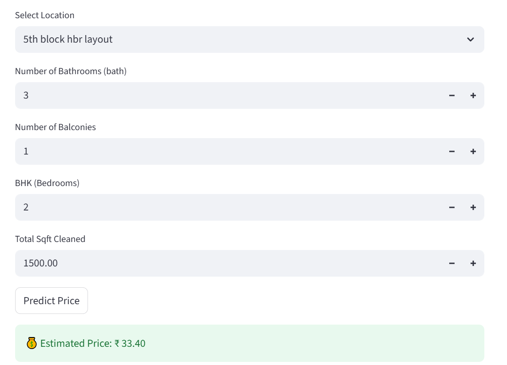

# 🏠 Housing Price Prediction  

**🚀 Quick Summary**  
This is an **end-to-end machine learning project** that predicts house prices using real estate data.  
Key highlights:  
- ✅ Cleaned and engineered features with **domain knowledge** (sqft conversions, bath/bed ratios, etc.).  
- ✅ Applied **outlier detection** (location-based price sanity checks).  
- ✅ Built and compared multiple models: **Linear Regression, Random Forest, XGBoost**.  
- ✅ Achieved **R² ≈ 0.993** with Random Forest.  
- ✅ Saved and deployed models using **pickle + Streamlit**.  

This project demonstrates the **full data science pipeline**: from raw data → preprocessing → feature engineering → modeling → deployment.  

---

## 📌 Project Overview  

Accurate property valuation is a critical task in the real estate industry. Prices are influenced by multiple factors — area, location, amenities, and market dynamics.  
This project applies **data science best practices** to clean, analyze, and model housing data, ensuring both domain relevance and statistical rigor.  

---

## 🛠️ Tech Stack  

- **Programming Language**: Python  
- **Data Manipulation**: pandas, numpy  
- **Visualization**: matplotlib, seaborn  
- **Machine Learning**: scikit-learn, xgboost  
- **Model Persistence**: pickle 
- **Deployment**: Streamlit  

---

## ⚙️ Key Steps  

### 1. Data Cleaning & Preprocessing  
- Handled missing values strategically (e.g., `bath`, `balcony`, `society`).  
- Converted inconsistent units (Sq. Meter, Sq. Yards, Acres → Sqft).  
- Processed ranges (`2100-2850`) by converting them to averages.  
- Created new engineered features:  
  - `price_per_sqft`  
  - `bhk_area_ratio`  
  - `room_size_avg`  
  - `bath_bed_ratio`  

### 2. Outlier Detection & Treatment  
- Removed extreme `price_per_sqft` values using **location-based standard deviation**.  
- Filtered unrealistic records (e.g., `bath > bhk + 2`).  
- Applied domain-driven logic for handling luxury properties and anomalies.  

### 3. Feature Engineering  
- Encoded categorical variables (`location`, `area_type`, `price_status`).  
- Designed derived ratios capturing density and property efficiency.  
- Checked multicollinearity with **VIF** to retain stable predictors.  

### 4. Model Building  
- Compared multiple algorithms:  
  - **Linear Regression, Ridge Regression**  
  - **Random Forest Regressor**  
  - **XGBoost Regressor**  
- Evaluated using:  
  - **R²** (goodness of fit)  
  - **RMSE** (error magnitude)  
  - Residual analysis  

### 5. Hyperparameter Tuning  
- Tuned Random Forest with **RandomizedSearchCV**.  
- Best parameters achieved:  
  - `n_estimators=500`, `max_depth=12`, `min_samples_split=5`, etc.  
- Selected final model based on cross-validation and residual diagnostics.  

### 6. Model Persistence  
- Saved both **base** and **tuned** Random Forest models using `pickle`.  
- Enables seamless deployment in Streamlit or Flask applications.  

---

## 📊 Results  

- **Random Forest (tuned)** performed best:  
  - Test R² ≈ **0.993**  
  - RMSE ≈ **6.35**  
- Residual plots confirmed minimal bias and random distribution of errors.  

---

## 🚀 Next Steps  

- Deploy model as an interactive **Streamlit app**.
- Add APIs for real-time prediction integration.

---

## ✨ Key Learnings  

- Leveraging **domain knowledge** (bathroom-to-bedroom ratios, sqft conversions) ensures realistic data.  
- Applying **location-specific outlier detection** improves model accuracy and stability.  
- Ensemble methods like **Random Forest** and **XGBoost** outperform linear models in capturing complex housing market patterns.  
- End-to-end project structuring (data → model → deployment) is crucial for real-world usability.  

---

## 📌 Author  

👤 **Muhammad Basharat Asghar**  

[LinkedIn](https://www.linkedin.com/in/basharat-asghar/)

- Data Scientist | Machine Learning Practitioner  
- Passionate about applying AI/ML in **real world** 
- Open to collaborations and new opportunities in Data Science & Machine Learning  

